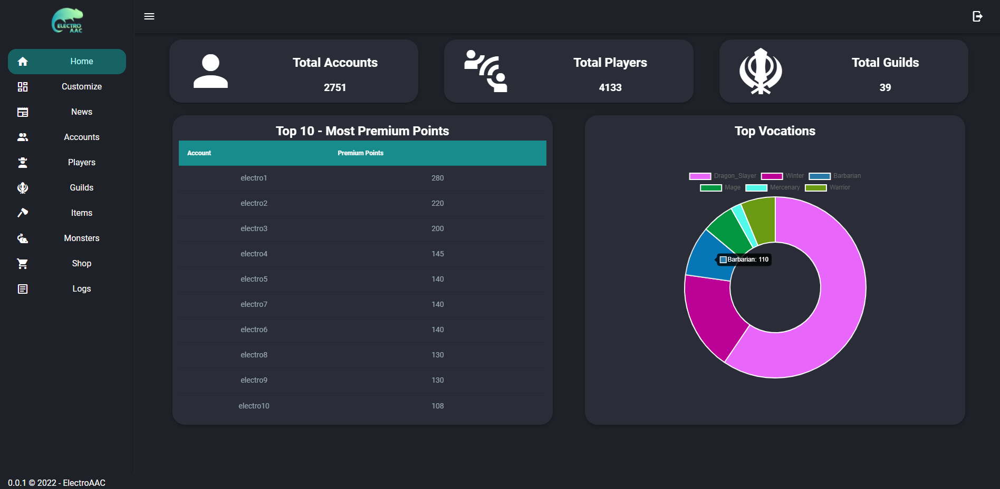

  

  A free and open-source Automatic Account Creator (AAC) written in Javascript Stack.
   

  
  
  
  

 

##  👨🏾‍💻 Project documentation.
<a href="https://walistonbelles1.gitbook.io/electroaac/" target="_blank"> Documentation </a>

## 👨🏾‍💻 Techs 

<h3> Front-end </h3>

<ul>
  <li> Vue.js </li>
  <ul>
    <li> <a href="https://github.com/championswimmer/vuex-module-decorators"> Vuex-module-decorators </a> </li>
    <li> <a href="https://www.tiny.cloud/docs/integrations/vue/"> TinyMCE </a> </li>
  </ul>
  <li> Vuetify.js </li>
  <li> Nuxt.js </li>
  <ul>
    <li> <a href="https://go.nuxtjs.dev/axios"> Axios </a> </li>
    <li> <a href="https://github.com/nuxt-community/router-module"> Router </a> </li>
    <li> <a href="https://www.npmjs.com/package/cookie-universal-nuxt"> Cookie-Universal </a> </li>
    <li> <a href="https://www.npmjs.com/package/@nuxtjs/toast"> Toast </a> </li>
  </ul>
  <li> Typescript </li>
</ul>

<h3> Backend </h3>
<ul>
  <li> Node.js </li>
  <ul>
    <li> <a href="https://www.npmjs.com/package/crypto-js"> Crypto </a> </li>
    <li> <a href="https://www.npmjs.com/package/js-sha1"> Js-sha1 </a> </li>
  </ul>
  <li> Adonis.js </li>
  <ul>
    <li> <a href="https://docs.adonisjs.com/guides/auth/introduction"> Auth </a> </li>
    <li> <a href="https://docs.adonisjs.com/guides/authorization"> Authorization </a> </li>
    <li> <a href="https://docs.adonisjs.com/guides/database/introduction"> Lucid ORM </a> </li>
    <li> <a href="https://docs.adonisjs.com/guides/mailer"> Mailer </a> </li>
    <li> <a href="https://docs.adonisjs.com/guides/views/introduction"> Views & Templates </a> </li>
  </ul>
  <li> Typescript </li>
</ul>

<h3> Services used </h3>
<li> Email service used for testing: </li>
<ul>
  <li> <a href="https://mailtrap.io/"> Mailtrap </a></li></ul>
 

## 👨🏾‍💻 Branchs

This project follows the framework based on git-flow, a release-based software workflow. <a href="https://platform.deloitte.com.au/articles/semantic-versioning-with-conventional-commits"> More Information </a>

That means, we use:

<li> <strong> Master branch</strong>, for current stable release </li>
<li> <strong> Develop branch</strong>, for development version (next release) </li>
<li> <strong> Feature branch</strong>, for features etc </li>

 

## 👨🏾‍💻 Commits

This repository follows the semantic commit pattern, with the addition of the tag [BACK] for a commit related to the backend, and [FRONT] for a commit related to the frontend. <a href="https://www.conventionalcommits.org/en/v1.0.0/#specification"> More Information </a>
 
 

## 👨🏾‍💻 Functionalities
### News Page
<li> [x] Show lastnews </li>

### View character informations
<ul>
  <li> [x] Show character info </li>
  <li> [x] Show character items </li>
  <li> [x] Show character skills </li>
  <li> [x] Show character deaths </li>
  <li> [ ] Show character achievements </li>
</ul>

### Manage Account
<ul>
  <li> [x] Page Account informations </li>
  <li> [x] List account characters </li>
  <li> [x] Create new character </li>
  <li> [x] Change character name </li>
  <li> [x] Delete character </li>
  <li> [ ] Register Account (RK) </li>
  <li> [ ] Change Email </li>
  <li> [ ] Change Password </li>
  <li> [ ] Account Logs </li>
</ul>

### Highscores
<ul>
  <li> [x] Widget Highscores </li>
  <li> [x] Show Highscores </li>
  <li> [ ] Create/Apply Filters </li>
</ul>

### Guilds
<ul>
  <li> [x] Show all Guilds </li>
  <li> [x] View Guilds </li>
  <li> [x] Create Guild </li>
  <li> [ ] Manage Guilds </li>
  <ul>
    <li> [ ] Invite Player </li>
    <li> [ ] Remove Player </li>
    <li> [ ] Promove Player </li>
    <li> [ ] Demote Player </li>
    <li> [ ] Add Surname Player </li>
    <li> [ ] Remove Surname Player </li>
    <li> [ ] Change Name </li>
    <li> [ ] Create Role </li>
    <li> [ ] Change Role </li>
    <li> [ ] Delete Role </li>
  </ul>
</ul>

### Online
<ul>
  <li> [x] Online Pages </li>
  <li> [x] Widget Players Online </li>
</ul>

### Lastkills
<ul>
  <li> [x] Lastkill Page </li>
</ul>

### Download
<ul>
  <li> [x] Download Page </li>
</ul>

### Customize Layout
<ul>
  <li> [x] Customize Layout Structure</li>
</ul>

### Dashboard - ADMIN
<ul>
  <li> [x] Validate permissions </li>
  <li> [x] Home Page </li>
  <li> [x] News Page</li>
  <ul>
    <li> [x] Create new post </li>
    <li> [x] List all post </li>
    <li> [x] Edit post </li>
    <li> [x] Delete post </li>
  </ul>
  <li> [x] Accounts </li>
  <ul>
    <li> [x] Find Account </li>
    <li> [x] Change account information </li>
    <li> [x] View all account characters </li>
  </ul>
</ul>

## Show-Off

### Create Character Page

 

### Dashboard - ADMIN - Home Page

## 👤 Author 

<h3> <b> Waliston Belles </b></h3>

<li> Github: <a href="https://github.com/WalistonBelles">@walistonbelles</a> </li>
<li> Linkedin: <a href="https://www.linkedin.com/in/waliston-belles-88927a212/"> Waliston Belles</a> </li>
<li> Discord:  Waliston#0145</a></li>
 