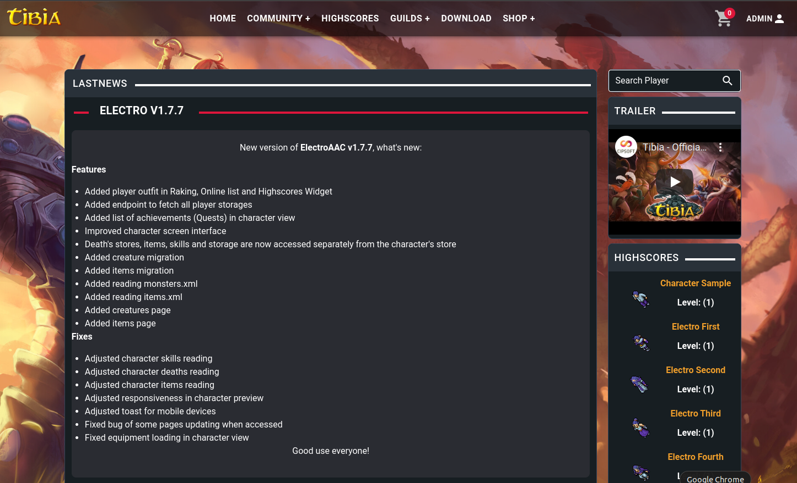
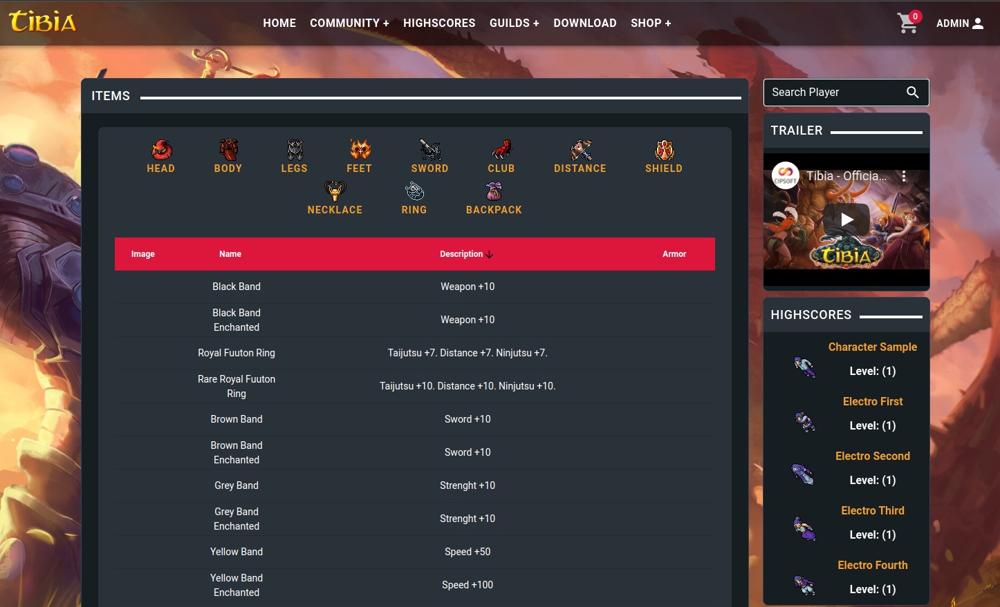
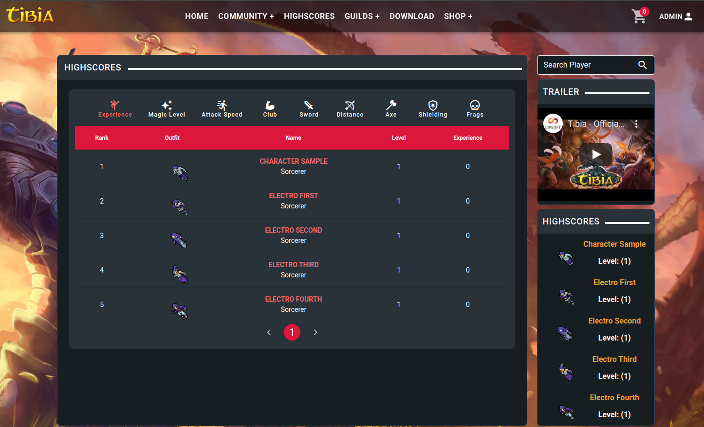
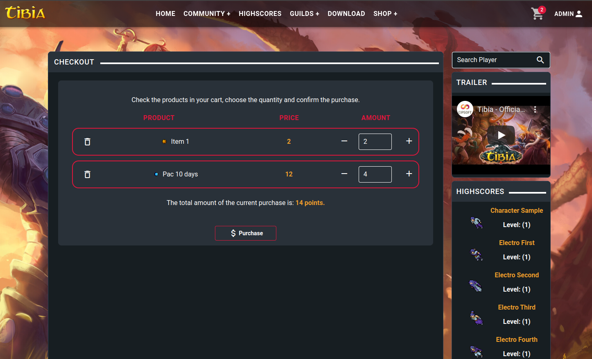
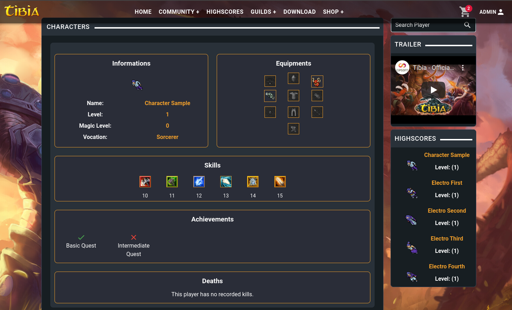

  

A free and open-source Automatic Account Creator (AAC) written in Javascript Stack.
 

 

## 👨🏾‍💻 Project documentation.

Learn all about the project through our documentation: <a href="https://walistonbelles1.gitbook.io/electroaac/" target="_blank"> Documentation </a>

 

## 👨🏾‍💻 Demo.

Want to see the project better? Access our demo: <a href="http://www.electro-aac.org/" target="_blank"> Demo </a>

 

## 👨🏾‍💻 Branchs

This project follows the framework based on git-flow, a release-based software workflow. <a href="https://platform.deloitte.com.au/articles/semantic-versioning-with-conventional-commits"> More Information </a>

That means, we use:

<li> <strong> Master branch</strong>, for current stable release </li>
<li> <strong> Develop branch</strong>, for development version (next release) </li>
<li> <strong> Feature branch</strong>, for features etc </li>

 

## 👨🏾‍💻 Commits

This repository follows the semantic commit pattern, with the addition of the tag [BACK] for a commit related to the backend, and [FRONT] for a commit related to the frontend. <a href="https://www.conventionalcommits.org/en/v1.0.0/#specification"> More Information </a>
 

## 👨🏾‍💻 @TODO

- Server connection to check online status
- Account Recovery
- Changing email and password
- Account Logs
- Character Sale
- Implement caching on the website
- Implement easy-to-use installation method to configure server directory
- Payment Methods (Pagseguro, Paypal, Mercado Pago, Picpay, Pix)
- Automated tests on the backend

 

## Show-Off

### Home Page

 

### Items Page

 

### Highscores Page

 

### Shop Page

 

### Character View Page

 

## Contributing

Contributions are more than welcome.

Pull requests should be made to the <strong>develop</strong> branch as that is the working branch, <strong> main </strong> is for release code.

## 👨🏾‍💻 Techs

<h3> Front-end </h3>

<ul>
  <li> Vue.js </li>
  <ul>
    <li> <a href="https://github.com/championswimmer/vuex-module-decorators"> Vuex-module-decorators </a> </li>
    <li> <a href="https://www.tiny.cloud/docs/integrations/vue/"> TinyMCE </a> </li>
  </ul>
  <li> Vuetify.js </li>
  <li> Nuxt.js </li>
  <ul>
    <li> <a href="https://go.nuxtjs.dev/axios"> Axios </a> </li>
    <li> <a href="https://github.com/nuxt-community/router-module"> Router </a> </li>
    <li> <a href="https://www.npmjs.com/package/cookie-universal-nuxt"> Cookie-Universal </a> </li>
    <li> <a href="https://www.npmjs.com/package/@nuxtjs/toast"> Toast </a> </li>
  </ul>
  <li> Typescript </li>
</ul>

<h3> Backend </h3>
<ul>
  <li> Node.js </li>
  <ul>
    <li> <a href="https://www.npmjs.com/package/crypto-js"> Crypto </a> </li>
    <li> <a href="https://www.npmjs.com/package/js-sha1"> Js-sha1 </a> </li>
  </ul>
  <li> Adonis.js </li>
  <ul>
    <li> <a href="https://docs.adonisjs.com/guides/auth/introduction"> Auth </a> </li>
    <li> <a href="https://docs.adonisjs.com/guides/authorization"> Authorization </a> </li>
    <li> <a href="https://docs.adonisjs.com/guides/database/introduction"> Lucid ORM </a> </li>
    <li> <a href="https://docs.adonisjs.com/guides/mailer"> Mailer </a> </li>
    <li> <a href="https://docs.adonisjs.com/guides/views/introduction"> Views & Templates </a> </li>
  </ul>
  <li> Typescript </li>
</ul>

<h3> Services used </h3>
<li> Email service used for testing: </li>
<ul>
  <li> <a href="https://mailtrap.io/"> Mailtrap </a></li></ul>
 

## 👤 Author

<h3> <b> Waliston Belles </b></h3>

<li> Github: <a href="https://github.com/WalistonBelles">Waliston Belles</a> </li>
<li> Linkedin: <a href="https://www.linkedin.com/in/waliston-belles-88927a212/"> Waliston Belles</a> </li>
<li> Discord:  Waliston#0145</a></li>
 
